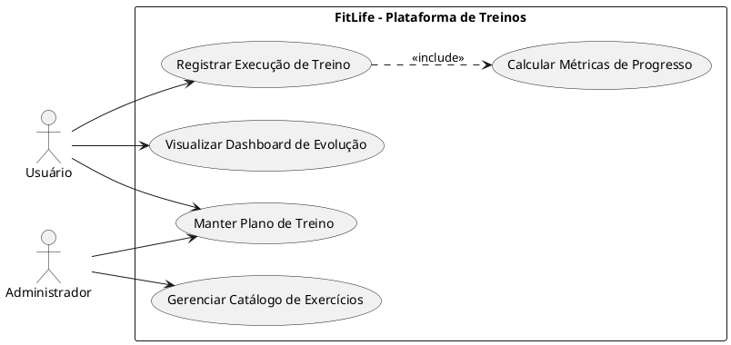

## Exemplo - Fluxo do Caso de Uso — App de Streaming

### Fluxo principal
1. Usuário realiza **cadastro de conta**.
2. Usuário faz **login** no aplicativo.
3. Usuário acessa **gerenciamento de perfil** (opcional).
4. Usuário **busca conteúdo** no catálogo.
5. Usuário seleciona e **reproduz conteúdo**.
6. Usuário pode **adicionar conteúdo à lista**.
7. Usuário escolhe **assinar plano**.
8. O sistema executa **processar pagamento** com o **Gateway de Pagamento**.
9. Com pagamento aprovado, assinatura é ativada e o usuário continua usando o serviço.

### Fluxos alternativos e exceções
- **A1 — Login inválido:** sistema informa credenciais incorretas e solicita nova tentativa.
- **A2 — Conteúdo indisponível:** sistema exibe mensagem de indisponibilidade e sugere títulos similares.
- **A3 — Pagamento recusado:** sistema informa falha no pagamento e permite nova tentativa ou troca de método.
- **A4 — Cancelar assinatura:** usuário solicita cancelamento e o sistema confirma encerramento ao fim do ciclo vigente.

### Pós-condições
- Conta criada e autenticada.
- Histórico/lista do usuário atualizado.
- Assinatura ativa (em caso de pagamento aprovado) ou cancelada conforme solicitação.

